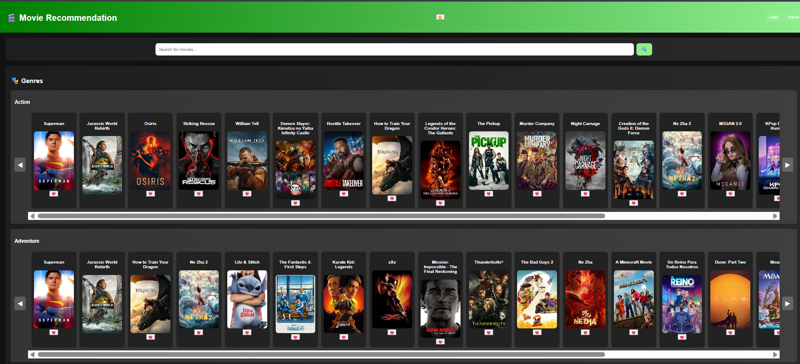
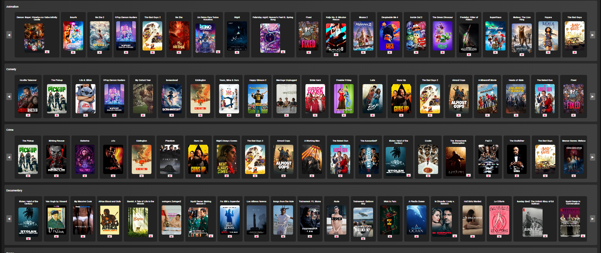
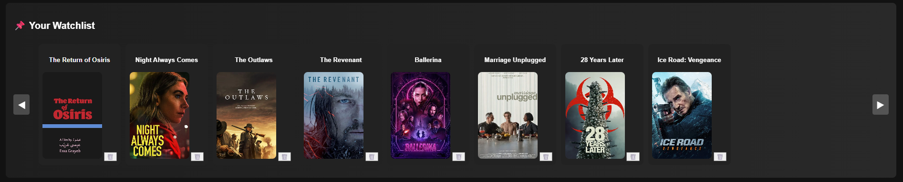
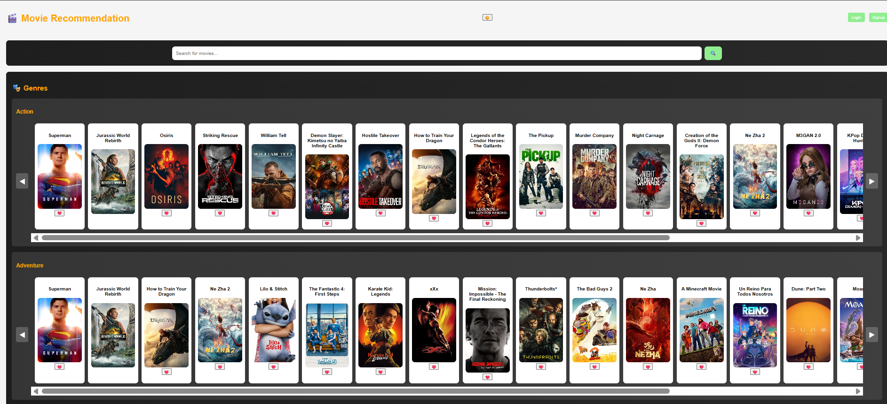

# 🎬 Movie Recommendation Web App  

A responsive **Movie Recommendation Website** built with **HTML, CSS, and JavaScript**, featuring **TMDB API integration** for:  
- 🔥 Trending Movies  
- 🎯 Recommended Movies  
- 🎭 Genre-based Browsing  
- 🔎 Search Functionality  
- 📌 Watchlist (LocalStorage)  
- 🌗 Light/Dark Theme Toggle  

---

## 🚀 Live Demo  
🔗 [Click Here](https://movierecommendsite.netlify.app/)  

---

## 📸 Screenshots

### 🏠 Home Page


### 🎥 Movie Details Page


### ⭐ Watchlist Page


### 🌙 Light Mode


---

## 🛠️ Tech Stack  


---

⭐ Features

- Fully responsive design with modern UI
- Integrated TMDB API for real-time movies
- Smooth sliders with left/right scroll buttons
- Persistent Watchlist using LocalStorage
- Authentication with Login/Signup (local)
- Accessibility with ARIA labels & alt texts

---

🤝 Contributing

Contributions, issues, and feature requests are welcome!
Feel free to fork this repo and submit a pull request.

---

## 📂 Installation & Setup  
Clone the repository and open `index.html` in your browser:  
```bash
git clone https://github.com/ayushdhama1/movie-recommend.git
